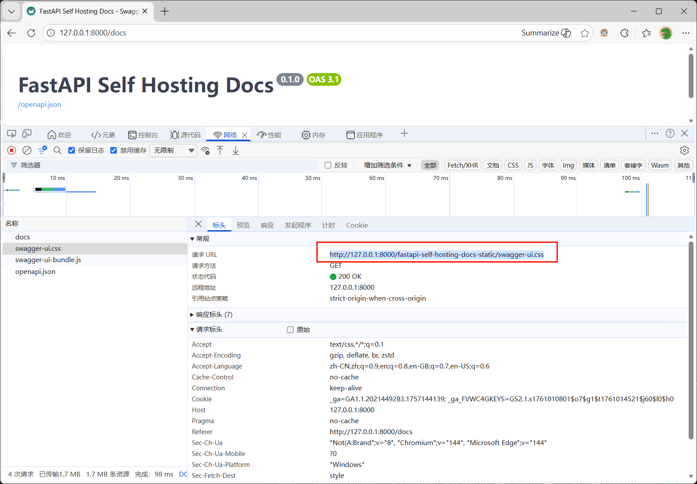
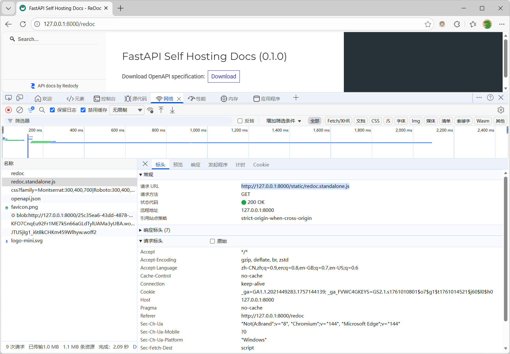

# FastAPI Self Hosting Docs

一个用于 FastAPI 应用程序的自托管文档解决方案，提供本地化的 Swagger UI 和 ReDoc 文档界面。

## 特性

- 🚀 **自托管文档**: 所有文档资源都托管在应用程序内部，无需外部依赖
- 📖 **Swagger UI**: 提供交互式的 API 文档界面
- 📋 **ReDoc**: 提供美观的 API 文档展示
- 🎨 **自定义样式**: 包含自定义的 favicon 和样式
- 🔧 **简单集成**: 只需一行代码即可替换标准 FastAPI 应用

## 安装

```bash
pip install fastapi-self-hosting-docs
```

## 快速开始

### 基本用法

```python
# 使用 FastAPI Self Hosting Docs 替代标准 FastAPI

# from fastapi import FastAPI
from fastapi_self_hosting_docs import FastAPI
app = FastAPI()

# 启动应用
import uvicorn
uvicorn.run(app)
```
**Swagger UI**



**ReDoc**



## 文档访问

启动应用后，可以通过以下地址访问文档：

- **Swagger UI**: `http://127.0.0.1:8000/docs`
- **ReDoc**: `http://127.0.0.1:8000/redoc`

## 与标准 FastAPI 的区别

| 特性 | 标准 FastAPI | FastAPI Self Hosting Docs |
|------|-------------|--------------------------|
| 文档资源 | 外部 CDN | 本地托管 |
| Swagger UI | `/docs` | `/docs` |
| ReDoc | `/redoc` | `/redoc` |
| 依赖 | 无额外依赖 | 仅需 fastapi |
| 自定义 favicon | 不支持 | 支持 |


## 许可证

本项目采用 Apache 2.0 许可证。详情请参阅 [LICENSE](LICENSE) 文件。

## 贡献

欢迎提交 Issue 和 Pull Request！

